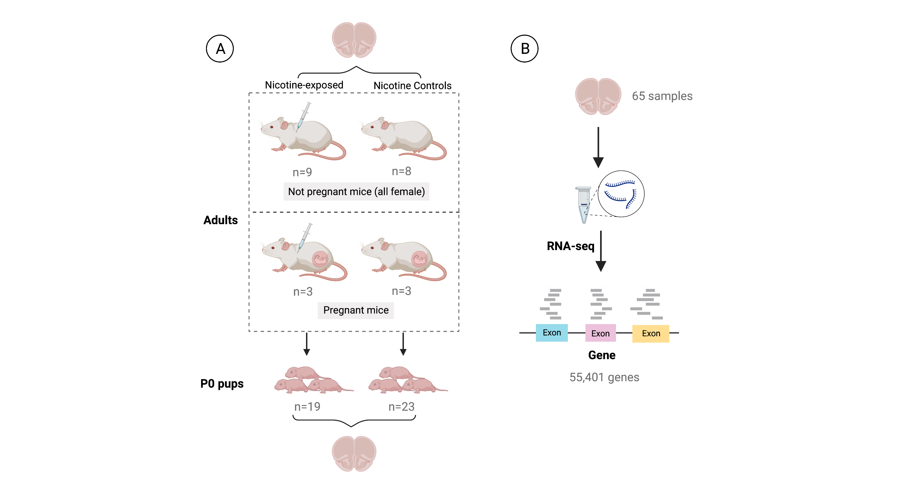
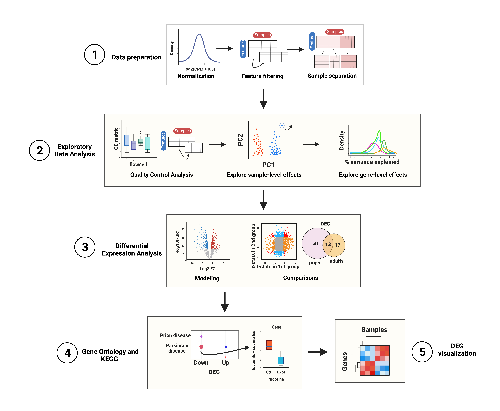

```{r, include = FALSE}
knitr::opts_chunk$set(
  collapse = TRUE,
  comment = "#>"
)
```

```{r vignetteSetup, echo=FALSE, message=FALSE, warning = FALSE}
## Track time spent on making the vignette
startTime <- Sys.time()

## Bib setup
library(RefManageR)

## Write bibliography information
bib <- c(
    R = citation(),
    BiocStyle = citation("BiocStyle")[1],
    dplyr = citation("dplyr")[1],
    knitr = citation("knitr")[1],
    rmarkdown = citation("rmarkdown")[1],
    sessioninfo = citation("sessioninfo")[1],
    clusterProfiler = citation("clusterProfiler"),
    edgeR = citation("edgeR"),
    SPEAQeasy = citation("SPEAQeasyWorkshop2020")[2],
    smokingMouse = citation("smokingMouse")[1],
    here = citation("here"),
    jaffelab = citation("jaffelab"),
    limma = citation("limma"),
    org.Hs.eg.db = citation("org.Hs.eg.db"),
    pheatmap = citation("pheatmap"),
    rmarkdown = citation("rmarkdown"),
    RefManageR = citation("RefManageR")[1],
    SummarizedExperiment = citation("SummarizedExperiment"),
    voom = RefManageR::BibEntry(
        "article",
        key = "voom",
        author = "CW Law and Y Chen and W Shi and GK Smyth",
        year = "2014",
        title = "Voom: precision weights unlock linear model analysis tools for RNA-seq read counts",
        journal = "Genome Biology",
        volume = "15",
        pages = "R29"
    )
)
```
--- 

28 May 2023

# Overview

**TODO**
This workshop aims to present the `SPEAQeasy` `r Citep(bib[["SPEAQeasy"]])` RNA-seq processing pipeline, demonstrating how its outputs can be used in Differential Expression Analyses (DEA) and the type of results it enables to obtain using other Bioconductor R packages such as  [limma](https://www.bioconductor.org/packages/limma), [edgeR](http://bioconductor.org/packages/edgeR), and [clusterProfiler](https://bioconductor.org/packages/clusterProfiler).

Briefly describe what is it , etc ... 


## Description
**TODO**
In this demo, participants will be able to understand what the pipeline does 
and what it returns through a Differential Expression Analysis performed on a SPEAQeasy 
dataset from the `smokingMouse` `r Citep(bib[["smokingMouse"]])` Bioconductor package 
which contains gene expression data and sample information from an RNA-sequencing 
experiment in mice. 


## Instructors

* [Daianna Gonzalez](https://daianna21.github.io)
* [Fernanda Renee Garcia](https://reneegf.github.io)
* [Nick Eagles](https://nick-eagles.github.io)


## Pre-requisites

* General familiarity with bulk RNA-seq data.
* Basic knowledge of differential expression. 
* Basic experience handling `SummarizedExperiment` and `GenomicRanges` packages.
* Previous review of http://research.libd.org/smokingMouse/ for data explanation. (Optional)

## Participation
**TODO**
Participants are expected to follow 


## _R_ / _Bioconductor_ packages used
**TODO**
List any _R_ / _Bioconductor_ packages that will be explicitly covered.

## Time outline
**TODO**

| Activity                     | Time |
|------------------------------|------|
| Introduction to SPEAQeasy               | 15m |
| Data overview                           | 20m |
| Differential Expression Analysis        | 55m |

Total: a 90 minute session.


## Workshop goals and objectives
**TODO**
List "big picture" student-centered workshop goals and learning
objectives. Learning goals and objectives are related, but not the
same thing. These goals and objectives will help some people to decide
whether to attend the conference for training purposes, so please make
these as precise and accurate as possible.

*Learning goals* 
are high-level descriptions of what
participants will learn and be able to do after the workshop is
over. 
*Learning objectives*, on the other hand, describe in very
specific and measurable terms specific skills or knowledge
attained. The [Bloom's Taxonomy](#bloom) may be a useful framework
for defining and describing your goals and objectives, although there
are others.

### Learning goals

Some examples:

* describe how to...
* identify methods for...
* understand the difference between...

### Learning objectives

* analyze xyz data to produce...
* create xyz plots
* evaluate xyz data for artifacts


# Workshop
**TODO**
Divide the workshop into sections (`## A Section`). Include
fully-evaluated _R_ code chunks. Develop exercises and solutions, and
anticipate that your audience will walk through the code with you, or
work on the code idependently -- do not be too ambitious in the
material that you present.

## Introduction 
**TODO**

### SPEAQeasy Overview
**TODO**


## Data overview and download 

The dataset that will be used for the DEA can be downloaded from the `smokingMouse` package. 
Visit [here](http://research.libd.org/smokingMouse/) for more details of this package.



    <figcaption style="color: gray; line-height: 0.85; text-align: justify"><font size="-2"><b>Figure 1</b>: <b>Experimental design of the study. </b> The data was obtained from an experiment in which <b>A)</b> 6 pregnant dams and 17 non-pregnant female adult mice were administered nicotine by intraperitoneal injection (IP; n=12) or controls (n=11). A total of 42 pups were born to pregnant dams: 19 were born to mice that were administered nicotine and 23 to control mice. Samples from frontal cortices of P0 pups and adults were obtained. <b>B)</b> RNA was extracted from those samples and then RNA-seq libraries were prepared and sequenced to obtain the expression counts of the genes. At the end, a dataset of 65 samples (either from adult or pup brain) and 55,401 genes was generated. </font> 

   </figcaption>


The data reside in a `RangedSummarizedExperiment` (RSE) object, containing the following assays:

* `counts`: original read counts of the 55,401 mouse genes across 208 samples (inlcuding the 65 nicotine samples).
* `logcounts`: normalized and scaled counts ($log_2(CPM + 0.5)$) of the same genes across the same samples; normalization was carried out applying TMM method with `cpm(calcNormFactors())` of `r BiocStyle::Biocpkg("edgeR")`.


The same RSE contains the sample information in `colData(RSE)` and the gene information in `rowData(RSE)`.
<mark style= "background-color: #FCF3CF"> Yellow </mark> variables correspond to SPEAQeasy outputs that are going to be used in downstream analyses. 

<mark style= "background-color: #FAECF8"> Pink </mark> variables are specific of the study, such as sample metadata and some others containing additional information of the genes. 

<mark style= "background-color: #DFF0FE"> Blue </mark> variables are Quality-Control metrics computed by `addPerCellQC()` of `r BiocStyle::Biocpkg("scuttle")`.


#### Gene Information 
Among the information in `rowData(RSE)` the next variables are of interest for the analysis:

* <mark style= "background-color: #FCF3CF"> <span style="font-family: monospace"> gencodeID</span> </mark>: GENCODE ID of each gene.
* <mark style= "background-color: #FCF3CF"> <span style="font-family: monospace"> ensemblID</span> </mark>: gene ID in Ensembl database.
* <mark style= "background-color: #FCF3CF"> <span style="font-family: monospace"> EntrezID</span> </mark>: identifier of each gene in NCBI Entrez database.
* <mark style= "background-color: #FCF3CF"> <span style="font-family: monospace"> Symbol</span> </mark>:  official gene symbol for each mouse gene.
* <mark style= "background-color: #FAECF8"> <span style="font-family: monospace"> retained_after_feature_filtering</span> </mark>: Boolean variable that equals TRUE if the gene passed the gene filtering (with `filterByExpr()` of `r BiocStyle::Biocpkg("edgeR")`) based on its expression levels and FALSE if not.

#### Sample Information 
Sample information in `colData(RSE)` contains the following variables:

* <mark style= "background-color: #FCF3CF"> <span style="font-family: monospace"> SAMPLE_ID</span> </mark>: is the name of the sample.
* <mark style= "background-color: #FCF3CF"> <span style="font-family: monospace"> ERCCsumLogErr</span> </mark>: a summary statistic quantifying overall difference of expected and actual ERCC concentrations for one sample. 
* <mark style= "background-color: #FCF3CF"> <span style="font-family: monospace"> overallMapRate</span> </mark>: the decimal fraction of reads which successfully mapped to the reference genome (i.e. *numMapped* / *numReads*).
* <mark style= "background-color: #FCF3CF"> <span style="font-family: monospace"> mitoMapped</span> </mark>: the number of reads which successfully mapped to the mitochondrial chromosome.
* <mark style= "background-color: #FCF3CF"> <span style="font-family: monospace"> totalMapped</span> </mark>: the number of reads which successfully mapped to the canonical sequences in the reference genome (excluding mitochondrial chromosomes).
* <mark style= "background-color: #FCF3CF"> <span style="font-family: monospace"> mitoRate</span> </mark>: the decimal fraction of reads which mapped to the mitochondrial chromosome, of those which map at all (i.e. *mitoMapped* / (*totalMapped* + *mitoMapped*))
* <mark style= "background-color: #FCF3CF"> <span style="font-family: monospace"> totalAssignedGene</span> </mark>: the decimal fraction of reads assigned unambiguously to a gene, with `featureCounts` (Liao et al. 2014), of those in total.
* <mark style= "background-color: #FCF3CF"> <span style="font-family: monospace"> rRNA_rate</span> </mark>: the decimal fraction of reads assigned to a gene whose type is ‘rRNA’, of those assigned to any gene.
* <mark style= "background-color: #FAECF8"> <span style="font-family: monospace"> Tissue</span> </mark>: tissue (mouse brain or blood) from which the sample comes.
* <mark style= "background-color: #FAECF8"> <span style="font-family: monospace"> Age</span> </mark>: if the sample comes from an adult or a pup mouse.
* <mark style= "background-color: #FAECF8"> <span style="font-family: monospace"> Sex</span> </mark>: if the sample comes from a female (F) or male (M)  mouse.
* <mark style= "background-color: #FAECF8"> <span style="font-family: monospace"> Expt</span> </mark>:  the experiment (nicotine or smoking exposure) to which the sample mouse was subjected; it could be an exposed or a control mouse of that experiment.
* <mark style= "background-color: #FAECF8"> <span style="font-family: monospace"> Group</span> </mark>: if the sample belongs to a nicotine/smoking-exposed mouse (Expt) or a nicotine/smoking control mouse (Ctrl).
* <mark style= "background-color: #FAECF8"> <span style="font-family: monospace"> plate</span> </mark>: is the plate (1,2 or 3) in which the sample library was prepared.
* <mark style= "background-color: #FAECF8"> <span style="font-family: monospace"> Pregnancy</span> </mark>:  if the sample comes from a pregnant (Yes) or not pregnant (No) mouse.
* <mark style= "background-color: #FAECF8"> <span style="font-family: monospace"> medium</span> </mark>: is the medium in which the sample was treated: water for brain samples and an elution buffer (EB) for the blood ones.
* <mark style= "background-color: #FAECF8"> <span style="font-family: monospace"> flowcell</span> </mark>: is the sequencing batch of each sample.
* <mark style= "background-color: #DFF0FE"> <span style="font-family: monospace"> sum</span> </mark>: library size (total sum of counts across all genes for each sample).
* <mark style= "background-color: #DFF0FE"> <span style="font-family: monospace"> detected</span> </mark>: number of non-zero expressed genes in each sample.
* <mark style= "background-color: #DFF0FE"> <span style="font-family: monospace"> subsets_Mito_sum</span> </mark>: total sum of read counts of mt genes in each sample
* <mark style= "background-color: #DFF0FE"> <span style="font-family: monospace"> subsets_Mito_detected</span> </mark>: total number of mt genes in each sample
* <mark style= "background-color: #DFF0FE"> <span style="font-family: monospace"> subsets_Mito_percent</span> </mark>: % of mt genes' counts of the total counts of the sample. 
* <mark style= "background-color: #DFF0FE"> <span style="font-family: monospace"> subsets_Ribo_sum</span> </mark>: total sum of read counts of ribosomal genes in each sample.
* <mark style= "background-color: #DFF0FE"> <span style="font-family: monospace"> subsets_Ribo_detected</span> </mark>: total number of ribosomal genes in each sample.
* <mark style= "background-color: #DFF0FE"> <span style="font-family: monospace"> subsets_Ribo_percent</span> </mark>: % of ribosomal genes' counts of the total counts of the sample.

Note: in our case, we'll use samples from the nicotine experiment only, so all samples come from brain and were treated in water.


```{r "load_pkgs", message=FALSE, warning=FALSE}
library("here")
library("SummarizedExperiment")
```

```{r "examine_outputs"}

#################################
##         Retrive data
#################################
## Provisional data source until smokingMouse pkg is accepted
load(here('provisional_data/rse_gene_mouse_RNAseq_nic-smo.Rdata'), verbose=TRUE)
## Explore complete rse_gene object (including smoking-exposed samples as well)
rse_gene

#################################
##   Extract data of interest
#################################
## Keep samples from nicotine experiment only
rse_gene_nic <- rse_gene[,which(rse_gene$Expt=='Nicotine')]
## New dimensions
dim(rse_gene_nic)

#################################
##  Access gene expression data
#################################

## Raw counts for first 3 genes in the first 5 samples
assays(rse_gene_nic)$counts[1:3,1:5]
## Log-normalized counts for first 3 genes in the first 5 samples
assays(rse_gene_nic)$logcounts[1:3,1:5]

#################################
##     Access sample data
#################################

## Info for the first 2 samples
head(colData(rse_gene_nic), 2)
```


## Differential Expression Analysis

**TODO**

<figure>
    
        <figcaption style="color: gray; line-height: 0.87; text-align: justify">
            <font size="-1.8">
                <b>Figure 2</b>: <b> Summary of the analyses. </b> Steps in yellow will be properly performed. 
                <b> 1. Data Preparation </b> 
                <b> 2. Exploratory Data Analysis </b> 
                <b> 3. Differential Expression Analysis </b> 
                <b> 4. GO & KEGG Analyses  </b> 
                <b> 5. DEG visualization  </b> </font> 
            <font size="0.8"> Abbreviations: CPM: counts per million; QC: quality control; PC: principal component; 
            DEG: differentially expressed genes; GO: Gene Ontology; KEGG: Kyoto Encyclopedia of Genes and Genomes.</font>
        </figcaption>
</figure>

### 1. Data preparation


### 2. Exploratory Data Analysis

#### 2.1 Quality Control Analysis

#### 2.2 Explore sample-level effects

#### 2.2 Explore gene-level effects


### 3. Differential Expression Analysis

#### 3.1 Modeling


#### 3.2 Comparisons


### 4. GO & KEGG analyses


### 5. DEG visualization


